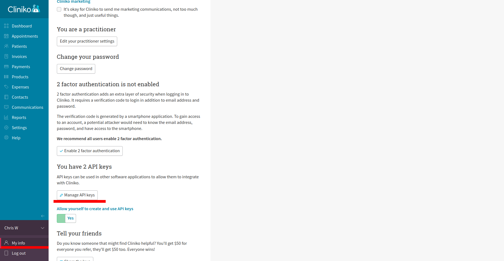
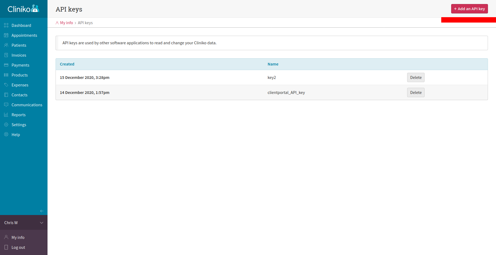

# clientPortalApp_BE

To setup the app for development, the env variables have to be declared in the .env file in the main directory.
    
    TEST_EMAIL = '(login for etheral email)'
    TEST_PASS = '(password from etheral email)'
    API_KEY2 = '(API key that you generate from clinoko)'

To generate the API keys login to cliniko. Click in My Info tab and click Manage API keys.

From there click Add an API key.

In the fetch requests in api_controller change the User-Agent to your name and email that you use for cliniko.

    headers: {
    Accept: "application/json",
    'Content-Type': 'application/json',
    Authorization: `Basic ${Base64.encode(process.env.API_KEY2)}`,
    "User-Agent": "Chris White (chris_white_12@hotmail.com)",
    }

etheral email: https://ethereal.email/

cliniko: https://coderacademyassessment.au2.cliniko.com/
